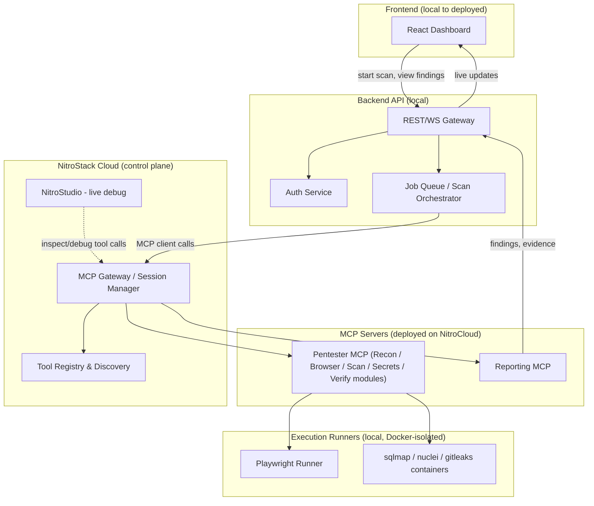
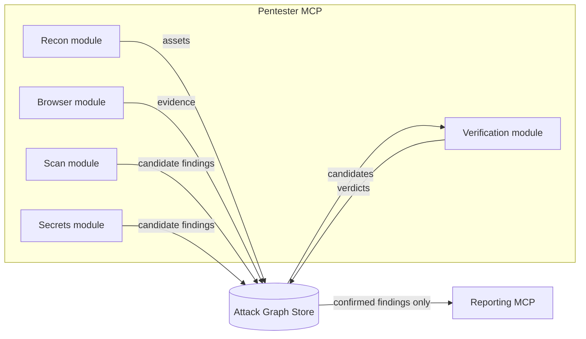
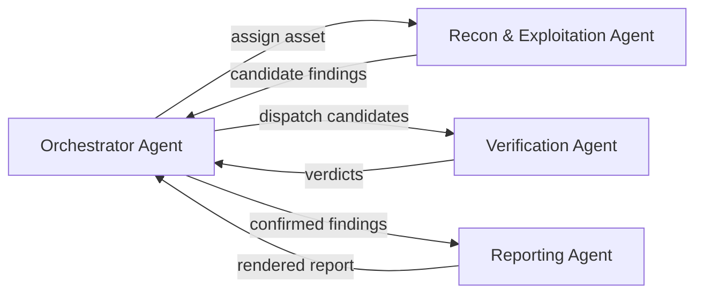
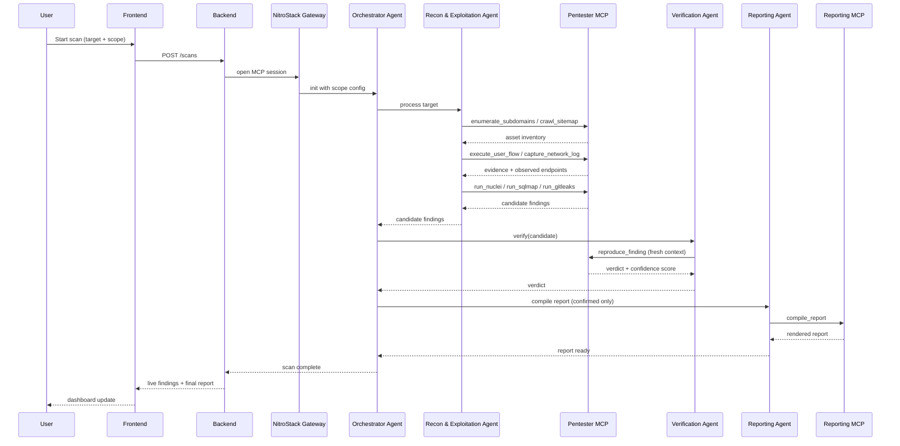
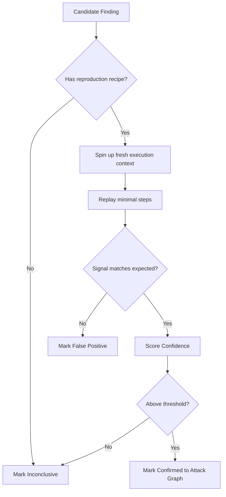
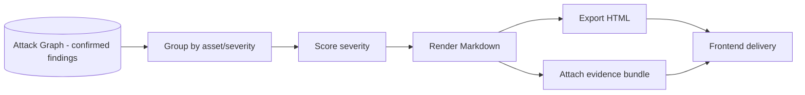
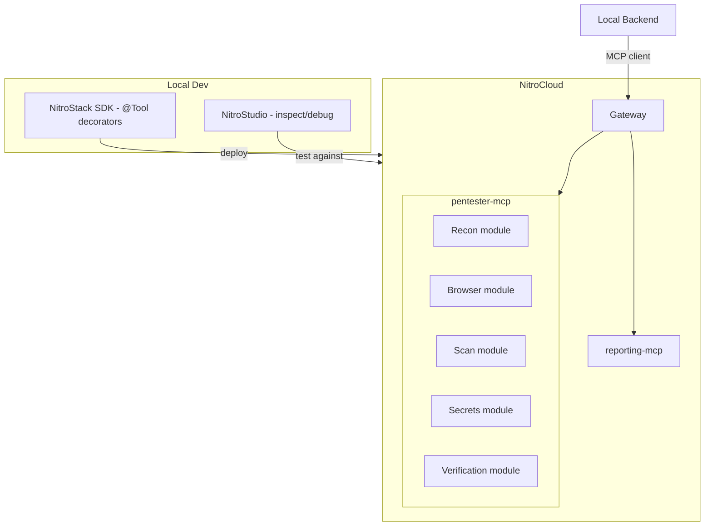

# Agentic Pentester — MCP-First System Architecture

**Document type:** Technical architecture (no code)
**Audience:** Hackathon technical review panel
**Orchestration layer:** NitroStack (SDK + NitroStudio + NitroCloud)
**Design priority:** MCP servers and tool design are the center of gravity; everything else exists to feed them work and consume their output.

---

## 0. Design Philosophy

The judging criteria reward *how* we use MCP, not just that an AI model is involved. So the architecture is built around one rule: **every capability the agents use — recon, browser control, scanning, secret detection, verification, reporting — is exposed as an MCP tool, never as a direct SDK call baked into agent code.**

This revision consolidates the tool surface into **two MCP servers** — a **Pentester MCP** that owns everything involved in finding and verifying issues, and a **Reporting MCP** that owns everything involved in turning verified findings into a deliverable. Consolidating doesn't mean flattening: inside the Pentester server, capability is still organized into distinct **tool modules** (Recon, Browser, Scan, Secrets, Verification) with their own DI-scoped services and guards — the boundary that mattered architecturally (verification running in a fresh execution context, scope checks on every live-target tool) is preserved *inside* the server, it's just no longer a network/deployment boundary between servers.

The agent layer is reduced to **four agents**: an Orchestrator, a combined Recon & Exploitation Agent, a Verification Agent, and a Reporting Agent. Fewer agents means fewer inter-agent handoffs to get wrong live in a demo, while the tool-level separation still gives judges a clear story about MCP-driven modularity.

---

## 1. High-Level System Architecture

**Data flow in one sentence:** the frontend requests a scan → the backend enqueues it and opens an MCP session against NitroStack → the Orchestrator Agent calls Pentester MCP tools in sequence (recon → browser/scan → secrets → verify, all within one server) → confirmed findings are handed to the Reporting MCP → the report streams back through the backend to the frontend.

---

## 2. MCP Architecture (Highest Priority)

Two servers, deliberately drawn along a **"does it touch a live target" vs. "does it just transform confirmed data"** line — that's the cleanest, lowest-risk place to cut the system in half.

### 2.1 Pentester MCP Server

The single server responsible for everything that discovers, probes, or verifies a finding. Internally organized into five tool modules so the tool list stays legible to the agents and each module keeps its own guard/permission scope, even though they now share a deployment.

- **Recon module** — `resolve_target`, `enumerate_subdomains`, `fingerprint_stack`, `crawl_sitemap`, `list_open_endpoints`. Passive/light-active only; runs first and populates the Attack Graph with the asset inventory everything else consumes.
- **Browser module** — `open_session`, `navigate`, `execute_user_flow`, `capture_network_log`, `capture_console_log`, `capture_screenshot`, `capture_heap_snapshot`, `close_session`. Drives an isolated Playwright context per session.
- **Scan module** — `run_sqlmap`, `run_nuclei`, `run_port_scan`. Fixed, schema-constrained parameters only — no free-form command strings reach the underlying binaries.
- **Secrets module** — `run_gitleaks`, `scan_response_bodies_for_secrets`. Redacts secret values by default; only a masked preview + location leaves this module.
- **Verification module** — `reproduce_finding`, `score_confidence`, `mark_false_positive`. This is the module that still gets an **execution-level** isolation guarantee: every `reproduce_finding` call spins up a brand-new Docker/Playwright context with no filesystem, cookie, or cache overlap with whatever run produced the candidate — enforced by the injected execution service, not by network separation between servers. Being co-located with the discovery tools doesn't weaken this: the isolation was always about process/session state, not which server hosted the code.

**Inputs (server-level):** target + scope config reference, scan-session ID.
**Outputs:** normalized asset inventory, evidence artifacts, candidate findings, and — from the Verification module — verdicts with confidence scores.
**Internal workflow:** every tool call passes through a shared scope guard (checked against `scope.yaml`) before it touches anything live; results are written to the shared Attack Graph store as they're produced.
**Dependencies:** Docker runtime, Playwright runner, scope service, tool binaries (sqlmap/nuclei/gitleaks images).
**Why one server instead of five:** recon, browser, scan, secrets, and verification are all steps in the *same* investigative loop — collapsing them removes cross-server round-trips for what was already a tightly sequential pipeline, while the module boundaries preserve the auditability and least-privilege story per capability.

### 2.2 Reporting MCP Server

- **Tools:** `compile_report`, `attach_evidence`, `score_severity`, `export_markdown`, `export_html`.
- **Inputs:** confirmed findings pulled from the Attack Graph (never candidates — only what the Verification module has marked `confirmed`).
- **Outputs:** rendered report (Markdown/HTML) + evidence bundle.
- **Why still a separate server:** it needs none of the Docker/network/browser privileges the Pentester server requires — keeping it separate means the report-rendering code path literally cannot reach a live target, which is a clean guarantee to state out loud to judges.

### Inter-server collaboration

The two servers still don't call each other directly. They share state through the backend-owned **Attack Graph store**: Pentester MCP writes assets, evidence, and verdicts; Reporting MCP reads only `confirmed` entries. The Orchestrator Agent is what sequences the hand-off from one server to the other.

---

## 3. NitroStack Architecture

| NitroStack concept | How we use it |
|---|---|
| **Project / Workspace** | One NitroStack workspace; **two projects** — `pentester-mcp` and `reporting-mcp` — each with its own deploy lifecycle. |
| **`@Tool` decorators** | Every tool across both servers' modules is a decorated method with a Zod schema — the enforcement point that keeps scanner/browser parameters constrained to validated enums, not free-form strings. |
| **Modules (NestJS-style)** | Inside `pentester-mcp`, Recon/Browser/Scan/Secrets/Verification are separate NitroStack modules with their own providers, so the DI container — not just folder structure — keeps them decoupled despite sharing a deployment. |
| **Dependency Injection** | Scope service, Docker execution service, Playwright runner client, and the Attack Graph client are injected singletons; the Verification module additionally gets its own execution-context factory (always provisions fresh containers, never reuses a pooled one). |
| **MCP registration & discovery** | NitroStack generates the JSON tool schema from decorators for both servers and registers them with the Gateway; the Orchestrator discovers tools via the registry rather than hardcoding tool lists. |
| **Guards / interceptors / pipes** | Guards enforce scope on every Pentester MCP tool call before the tool body runs; interceptors log every call (args + requester identity) across both servers for the audit trail. |
| **NitroStudio** | Used to call each server's tools directly during development, inspect payloads, and visualize agent tool-calling on the Ops Canvas — this is also what we'll drive live in the demo. |
| **NitroCloud deployment** | Both servers deployed as NitroCloud-hosted MCP endpoints; the local backend connects to them as an MCP client over the Gateway. |
| **Monitoring** | NitroCloud's per-tool latency/error metrics double as the audit trail, now covering two deployables instead of six. |

---

## 4. Agent Architecture

Four agents total, each an MCP **client** with no tools of its own — they call tools on the two servers above, scoped by which modules the Gateway permits them to reach.

- **Orchestrator Agent** — owns the scan lifecycle end-to-end. Context: scope config + Attack Graph state. Sequences the pipeline (recon → browser/scan → secrets → verification → report), retries failed tool calls, and is the only agent allowed to mark a scan complete. Holds no direct scanning/reporting tool access itself — it delegates to the other three agents.
- **Recon & Exploitation Agent** — merges what were previously the Recon, Browser, Vulnerability, and Secrets agents into one. Calls the Recon, Browser, Scan, and Secrets modules on Pentester MCP in sequence for a given asset: enumerate → crawl/authenticate → scan → check for exposed secrets. Every result it produces is treated as a *candidate* — this agent has no authority to confirm a finding, only to surface it.
- **Verification Agent** — the only agent with authority to change a finding's status. Calls the Verification module on Pentester MCP with a fresh execution context per candidate; deliberately has no memory of *how* the original finding was produced, only the reproduction recipe, which is what keeps it an independent check rather than a rubber stamp on the Recon & Exploitation Agent's own output.
- **Reporting Agent** — consumes only `confirmed` findings from the Attack Graph and calls Reporting MCP tools to compile and render.

Prompt strategy across all four: each agent's system prompt scopes it to its own tool subset, enforced at the NitroStack Gateway level (not just prompt instruction) — the Recon & Exploitation Agent, for instance, has no Gateway permission to call Verification or Reporting tools even though they now live in the same deployable server. Every agent is told to treat tool output as untrusted data, not instructions, since scanned/crawled content can contain attacker-controlled strings.

---

## 5. End-to-End Workflow

Findings still stream to the frontend as each stage completes, not only at the end.

---

## 6. Communication Flow

- **Frontend ↔ Backend:** REST for scan CRUD, WebSocket for live finding/status updates.
- **Backend ↔ NitroStack:** backend is an MCP client authenticated via NitroStack's built-in auth modules (JWT/API key); opens one MCP session per active scan.
- **MCP-to-MCP:** now a single hand-off — Pentester MCP → Reporting MCP — mediated through the Attack Graph store rather than a direct call, so Reporting MCP still can't be triggered on unverified data even though there are only two servers to coordinate.
- **Context propagation:** scope config and scan-session ID are attached to every tool call via NitroStack DI-injected context, so both servers can independently re-check scope without trusting the caller.
- **Tool execution lifecycle:** guard (scope check) → interceptor (audit log start) → tool body → interceptor (audit log result) → response. Applies uniformly across all five Pentester modules and both Reporting tools.
- **Attack graph updates:** append-only; every tool call that discovers an asset or finding writes a new node/edge.
- **Audit logging:** every tool invocation, argument set, and result is logged with requester (which agent), timestamp, and scan-session ID, surfaced via NitroCloud monitoring for both deployables.

---

## 7. Browser Automation Architecture

Playwright sits behind the Browser module of Pentester MCP, never called directly by an agent:

- **Sessions:** one Playwright browser context per `open_session` call, torn down explicitly or on timeout.
- **CDP access:** used for network + console monitoring and heap snapshots, exposed as separate tools so the Recon & Exploitation Agent requests only what it needs.
- **Network/console monitoring:** normalized into the same finding-evidence schema used by the Scan module, so the Verification module can replay them consistently.
- **Screenshots:** taken at flow checkpoints and on anomalies, stored as evidence artifacts referenced by ID.
- **User-flow automation:** flows are declarative step lists validated against scope before execution, not free-form agent-generated Playwright code.
- **Data returned:** structured JSON (URLs hit, status codes, headers, timing) plus evidence artifact references — raw bodies are stored, not streamed wholesale through the LLM context.

---

## 8. Security Tool Integration

sqlmap, nuclei, and gitleaks are wrapped as Scan/Secrets module tools on Pentester MCP with a **fixed, schema-constrained parameter set**.

- **Execution flow:** tool call → scope guard → parameter validation against allow-list → container launch → output capture → parse to normalized finding → cleanup.
- **Docker isolation:** each tool runs in its own minimal image, egress restricted to the declared target only — enforced at container network policy level.
- **Scope enforcement:** the same guard used by the Recon module runs here — an out-of-scope target never reaches the container.
- **Orchestration through NitroStack:** container lifecycle managed by an injected execution service inside Pentester MCP; interceptors log start/stop/exit-code for every run.

---

## 9. Verification Architecture

Still the project's core differentiator — and consolidating servers doesn't relax it, because the guarantee was always about execution context, not deployment topology:

- **Fresh execution context:** every `reproduce_finding` call gets a new container/browser session with no filesystem, cookie, or cache overlap with the run that produced the candidate, provisioned by a dedicated factory in the Verification module.
- **Reproducibility:** candidate findings must carry a minimal, explicit reproduction recipe or they're auto-marked inconclusive.
- **Evidence validation:** observed signal from the fresh run is diffed against the expected signal.
- **Confidence scoring:** weighted from reproduction success, signal strength, and agreement across independent evidence sources.
- **False-positive elimination:** below-threshold findings are filtered from the report but retained in the Attack Graph as `unconfirmed`.
- **Feedback loop:** verdicts write back to the Attack Graph; the Orchestrator can deprioritize a scanner profile mid-scan if its false-positive rate is high.

---

## 10. Report Generation

- **Workflow:** Reporting Agent asks Reporting MCP to pull only `confirmed` findings from the Attack Graph → group by severity/asset → render.
- **Finding schema:** `{id, type, asset, severity, confidence, description, evidence[], verification_transcript, discovered_by, verified_at}`.
- **Evidence collection:** screenshots, request/response captures, and tool logs referenced by artifact ID, bundled on export.
- **Severity scoring:** simplified CVSS-style (impact × exploitability × confidence bucket).
- **Output formats:** Markdown (source of truth) rendered to HTML for the dashboard.
- **Delivery:** report + evidence bundle pushed back through the backend to the frontend.

---

## 11. Security & Guardrails

- **`scope.yaml`:** single source of truth for in-scope hosts/paths/rate limits, loaded once per scan session and injected into Pentester MCP's shared guard — every module (Recon, Browser, Scan, Secrets) checks against it before touching a live target.
- **Docker sandboxing:** every external tool and Playwright session runs isolated and minimally-privileged, egress restricted to the declared target.
- **Prompt injection protection:** all tool output is treated as untrusted data; instructions embedded in scanned content are never followed. Only the Orchestrator can initiate new work based on discovered content, and only within scope.
- **Tool permissions:** the NitroStack Gateway restricts which agent identity may call which module — the Recon & Exploitation Agent cannot call the Verification or Reporting tools even though they now share (or neighbor) a deployment, and the Reporting Agent cannot reach anything on Pentester MCP at all.
- **Scope enforcement:** applied at the guard layer of every Pentester MCP module — the primary safety boundary of the whole system.
- **Audit logging:** every tool call, container run, and verdict logged with scan-session ID via NitroStack interceptors + NitroCloud monitoring.
- **Safe execution model:** nothing with network/exec capability is ever driven by raw LLM-generated strings — all dangerous parameters are constrained to validated enums/schemas defined in the `@Tool` decorators.

---

## 12. Mermaid Diagrams

Diagrams for §1 (system architecture), §2 (Pentester MCP internals), §4 (agent hand-offs), and §5 (sequence) are included above. Additional diagrams below.

**Verification Workflow:**

**Report Generation Workflow:**

**NitroStack Deployment:**

---

## 13. Hackathon MVP Scope

**MVP (must build):**
- Pentester MCP with Recon module + Scan module (nuclei only) + Verification module (fresh-context replay)
- Reporting MCP with `compile_report` + `export_markdown`
- Orchestrator, Recon & Exploitation Agent, Verification Agent, Reporting Agent — all four, driving a linear pipeline
- `scope.yaml` guard enforced on every Pentester MCP module
- Minimal frontend: start scan, live finding feed, view report

**Nice-to-have (if time allows):**
- Browser module with full user-flow automation and screenshot evidence
- sqlmap integration in the Scan module
- Secrets module (gitleaks)
- Confidence scoring UI with evidence diff view

**Future improvements:**
- Multi-target/multi-tenant scope management
- Additional scanner integrations behind the same Scan module schema
- Attack Graph visualization in the frontend
- Feedback loop that tunes scanner profile selection based on historical false-positive rate

---

## Summary

Two MCP servers now carry the whole system: **Pentester MCP** (Recon, Browser, Scan, Secrets, and Verification as internally-separated modules) and **Reporting MCP** (report compilation only, deliberately kept privilege-free). Four agents — Orchestrator, Recon & Exploitation, Verification, Reporting — sequence the work across them. The two guarantees worth walking judges through are unchanged from the six-server design: Verification always runs in a fresh execution context regardless of which server hosts it, and no live-target tool ever executes outside `scope.yaml` enforcement.
